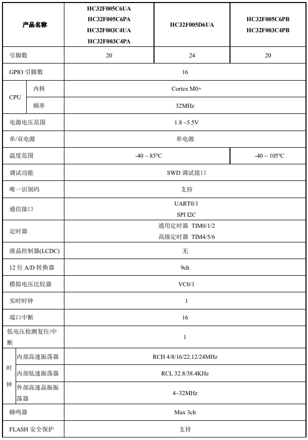
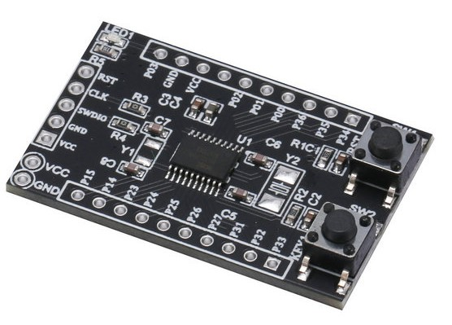
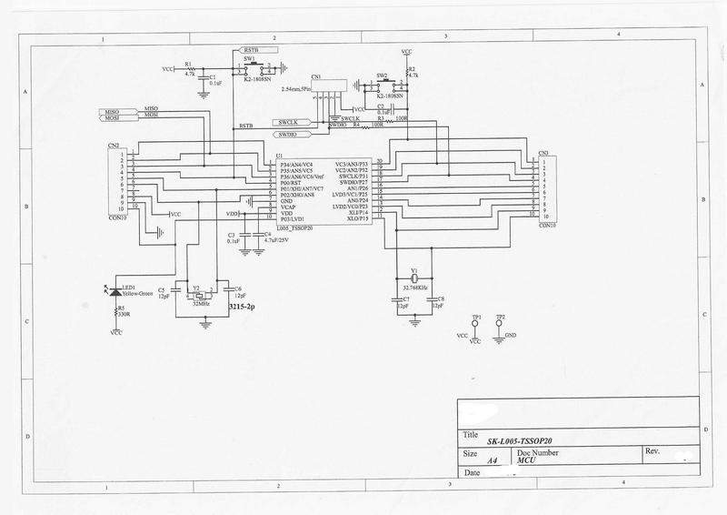

# [HC32F005](https://github.com/SoCXin/HC32F005)

* [hdsc](https://www.hdsc.com.cn/)：[Cortex-M0](https://github.com/SoCXin/Cortex)
* [L2R2](https://github.com/SoCXin/Level) ：32 MHz x 0.94 DMIPS/MHz, [2.46 CoreMark/MHz](https://www.eembc.org/coremark/scores.php)

## [简介](https://github.com/SoCXin/HC32F005/wiki)

[HC32F005](https://github.com/SoCXin/HC32F005) 为小封装高性价比MCU，12位1Msps采样SARADC，内置运放

### 关键特性

* 宽电压1.8～5.5V
* 集成6位DAC和可编程基准输入的2路电压比较器VC

### [资源收录](https://github.com/SoCXin)

* [参考资源](src/)
* [参考文档](docs/)
* [参考工程](project/)

### [选型建议](https://github.com/SoCXin)

[HC32F003](https://github.com/SoCXin/HC32F005),[HC32F005](https://github.com/SoCXin/HC32F005),[HC32L110](https://github.com/SoCXin/HC32L110) 规格类似，HC32L110 拥有 RTC 外设

* TSSOP20
* QFN20
* QFN24
#### 相关开发板

### [探索芯世界 www.SoC.xin](http://www.SoC.Xin)
